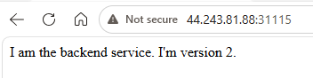

# Lab 1 - Kubernetes Essentials

## 1.1 - Pods, ReplicaSets and Deployments

The intent of this lab is to familiarise you with the standard method of getting apps into Kubernetes: `Deployments`. However, as we progress, it is important to understand the relationship between `Pods`, `ReplicaSets` and `Deployments`.

The container images we'll use for this lab are ones we'll keep using throughout the course. There are several different versions of our simple back-end image in AWS's public container registry.

### Task 1 - Spin up a Pod

1. Create a pod named `simple`, using the `public.ecr.aws/qa-wfl/qa-wfl/qakf/sbe:v1` image

```
kubectl run simple --image=public.ecr.aws/qa-wfl/qa-wfl/qakf/sbe:v1
```

Lots happens under the hood, things we will discuss more as the course progresses.. 
 
i. kubectl converts your command into a ***Kubernetes API request***.  
ii. The request is sent securely to the ***API Server***.  
iii. The API Server ***authenticates*** your identity.  
iv. Your ***permissions*** are checked using RBAC.  
v. Any configured ***Admission Controllers*** (such as Kyverno) evaluate the request.  
vi. The Pod definition is stored in etcd, the Kubernetes cluster ***database***.  
vii. The Scheduler selects the most appropriate ***worker node***.  
viii. The chosen worker node's ***kubelet*** notices a new Pod has been assigned.  
ix. The kubelet instructs the ***container runtime*** (containerd) to ensure the required image is available.  
x. If the ***image*** is not already cached locally, it is ***downloaded*** from the container registry.  
xi. The container runtime ***creates the container*** and starts the application.  
xii. Kubernetes ***monitors*** the Pod and reports its status back to the ***API Server***.  

Phew !!!!


<br/>Example output:
```
pod/simple created
```

2. Get the new pod's IP address 

```
kubectl get pods --output wide
#or
kubectl get pod simple --output=custom-columns=IP:.status.podIP --no-headers
```

<br/>Example output (your IP dill differ):
```
NAME     READY   STATUS    RESTARTS   AGE     IP         ...
simple   1/1     Running   0          3m59s   10.42.0.10 ...

#or

10.42.0.10
```

3. **cURL** your pod's IP address at port 8080

```
curl {pod ip}:8080
```

Notice that containers use internal IP addresses, so its only accessible from within cluster, you cannot browse to this container from your Web browser... yet

Example output:

```
I am the backend service. I'm version 1!
```
> ### Behind the Scenes (Optional)
>
> You were instructed to use TCP port **8080**, but how did we know that the application was listening on this port?
>
> Let's investigate.
>
> **i. Identify the worker node**
>
> ```bash
> kubectl get pod simple -o wide
> ```
>
> Example output:
>
> ```text
> NAME     READY   STATUS    IP          NODE
> simple   1/1     Running   10.42.0.6   k8s-worker-1
> ```
>
> Notice the **NODE** column. This tells you which Kubernetes worker is running the Pod (yours may differ).
>
> **ii. Connect to the worker node**
>
> Using the AWS Management Console, identify the corresponding EC2 instance and establish an SSH session to the worker node on which your container is running.
>
> **iii. Locate the image**
>
> ```bash
> sudo crictl images
> ```
>
> Make a note of the **IMAGE ID** for:
>
> ```text
> public.ecr.aws/qa-wfl/qa-wfl/qakf/sbe:v1
> ```
>
> **iv. Inspect the image**
>
> ```bash
> sudo crictl inspecti <image-id>
> ```
>
> Scroll down to the following section:
>
> ```text
> "Entrypoint": [
>   "/asmttpd"
> ],
> "Cmd": [
>   "/web_root",
>   "8080"
> ]
> ```
>
> Together these form the command:
>
> ```text
> /asmttpd /web_root 8080
> ```
>
> This explains why the application responds on **TCP port 8080**.

>> Note: asmttpd is a lightweight web server used by the QA training images. It serves the web content stored in /web_root, with 8080 supplied as the TCP port on which the application should listen.
>
> Close the *worker* ssh session window and return to your *controller* ssh session window.
>
> **Considerations**
>
> - Why did we inspect the worker rather than the control plane?
> - Would every worker necessarily contain this image?
> - Why might Kubernetes cache images locally?


### Task 2 - Create a YAMLfest

4. Let’s look at a PodSpec. Similar command to before, but we’re going to perform a `client`-side `dry-run` and output the result in YAML format to a file named pod.yaml. This is a convenient way to create a kubernetes manifest: 

```bash
kubectl run hello --image=public.ecr.aws/qa-wfl/qa-wfl/qakf/sbe:v1 --dry-run=client -o yaml > pod.yaml 
```

5. Now examine the pod.yaml file. 

```bash
cat pod.yaml 
```

> Note that there are a number of properties. Some of these are required and have been added by the api-server when we ran the pod, others are optional. Note the API version, v1. Pods are part of the “core” kubernetes API. Pods have a “kind” of “Pod”. All k8s resources have a “kind”. Some metadata has also been added. The creationTimestamp is null because the pod was never actually created. A resources stanza has been added to the podspec (more on that much later on) and the pod has a status of null (again, because it was never created). The podspec section is the most important, because all of the controllers we’ll be looking at create and manage pods, somewhere in their manifest. 

```yaml
apiVersion: v1 
kind: Pod 
metadata: 
  creationTimestamp: null 
  labels: 
    run: hello 
  name: hello 
spec: 
  containers: 
  - image: public.ecr.aws/qa-wfl/qa-wfl/qakf/sbe:v1 
    name: hello 
    resources: {} 
  dnsPolicy: ClusterFirst 
  restartPolicy: Always 
status: {} 
```
7. Let’s create a pod from the manifest. Tell Kubernetes to apply this manifest to the cluster. 

```bash
kubectl apply -f pod.yaml 
```

8. Confirm that you now have two containers, both based on the same image, one created interactively (simple), the other through a manifest (hello). 

```bash
kubectl get pods 
```

### Task 3 - Create a ReplicaSet

6. A Pod is fine, but we probably want to “guarantee” that we have at least one pod of our application running at all times. This is a job for a ReplicaSet! Create a file called rs.yaml and add the following content to it (there is no convenient shorthand for generating a ReplicaSet manifest): 

rs.yaml: 
```yaml
apiVersion: apps/v1 
kind: ReplicaSet 
metadata: 
  name: hello 
  labels: 
    app: hello 
spec: 
  replicas: 3 
  selector: 
    matchLabels: 
      app: hello 
  template: 
    metadata: 
      labels: 
        app: hello 
    spec: 
      containers: 
      - name: hello-world 
        image: public.ecr.aws/qa-wfl/qa-wfl/qakf/sbe:v1
```

>Note the apiVersion is apps/v1. ReplicaSets aren’t part of the “core” API. We’re saying that we always want to have 3 pods running and the podspec from before is now nested in the ReplicaSet’s template stanza. 

7. Let’s create the ReplicaSet by telling Kubernetes to apply this manifest to the cluster. 

```
kubectl apply -f rs.yaml 
```

8. List your pods and replicasets ("rs" is the short name for replicaset) 

```
kubectl get pods,rs 
```

Example output:
```
NAME              READY   STATUS    RESTARTS   AGE
pod/hello         1/1     Running   0          38m
pod/hello-d2g6b   1/1     Running   0          9s
pod/hello-fcd9g   1/1     Running   0          9s
pod/hello-h5lgk   1/1     Running   0          9s
pod/simple        1/1     Running   0          56m

NAME                    DESIRED   CURRENT   READY   AGE
replicaset.apps/hello   3         3         3       9s
```

Note that pods that are part of a replicaset have auto-generated name suffixes. The READY count will reflect the DESIRED coount once all pods are created. Your output may show 0-3 READY pods depending on how fast you typed! 

### Task 4 - Delete a Pod managed by a ReplicaSet

9. Now delete a pod that is a member of the replicaset (you’ll need to use one of the auto-generated names. I’m using the first one in my list) and then immediately list your pods and ReplicaSets again: 

```
kubectl delete pod hello-d2g6b --wait=false && kubectl get pods,rs
```

We told kubectl not to wait for finalisers so hopefully we can see output similar to the following (again, it all depends on how fast you type!): 

Example output:
```bash
NAME              READY   STATUS              RESTARTS   AGE
pod/hello         1/1     Running             0          47m
pod/hello-d2g6b   1/1     Terminating         0          8m42s
pod/hello-fcd9g   1/1     Running             0          8m42s
pod/hello-h5lgk   1/1     Running             0          8m42s
pod/hello-rm7lw   0/1     ContainerCreating   0          0s
pod/simple        1/1     Running             0          65m

NAME                    DESIRED   CURRENT   READY   AGE
replicaset.apps/hello   3         3         2       8m42s
```

The ReplicaSet controller “noticed” almost immediately that we were down to 2 pods and told the api-server to run a new one. How does it know? The labels. In the spec there is a `matchLabels` stanza which is looking for a `label` of `app` with a value of `hello`. The podspec in the template specifies that each pod should be created with a label of app with a value of hello. The replicaset asks the api-server how many pods have that label and if the number is wrong, it tells the api-server to add or remove pods 

### Task 5 - Update the ReplicaSet

Now let’s try to update our replicaset to use v2 of our awesome application. 

10. Make a copy of rs.yaml and name it rs2.yaml

```bash
cp rs.yaml rs2.yaml
```
11. Edit rs2.yaml file and change the image in the podspec to point to :v2 (it should be the very last line) 

```yaml
        image: public.ecr.aws/qa-wfl/qa-wfl/qakf/sbe:v2 
```
 
12. Now try to apply the new version. 

```
kubectl apply -f rs2.yaml 
```

13. Looks like it worked. But if you list all your pods again, you’ll see that they haven’t been recreated. 

14. Try finding the pods’ images by piping the output of `kubectl describe` to `grep` (this command is case sensitive): 

```
kubectl describe pod | grep Image: 
```
Example output:
```
    Image:          public.ecr.aws/qa-wfl/qa-wfl/qakf/sbe:v1
    Image:          public.ecr.aws/qa-wfl/qa-wfl/qakf/sbe:v1
    Image:          public.ecr.aws/qa-wfl/qa-wfl/qakf/sbe:v1
    Image:          public.ecr.aws/qa-wfl/qa-wfl/qakf/sbe:v1
    Image:          public.ecr.aws/qa-wfl/qa-wfl/qakf/sbe:v1
```
They’re all running v1 still. 

A ReplicaSet will only apply this configuration change when it creates a new pod. Try deleting a pod manually again and then retry finding the pods’ images (the grep command above). You’ll now have one v2 and four v1s. 

15. Try scaling the ReplicaSet to zero and then back up to 3 again: 

```
kubectl scale rs hello --replicas=0 
kubectl scale rs hello --replicas=3 
```

You’ll now have 3 v2 pods if you redo the grep command. The 2 v1 pods are not part of the replicaset remember, so they remain as-is. 

### Task 6 - Delete the ReplicaSet and Pods

16. Delete all pods

```bash
kubectl delete pods --all 
```

17. Verify all pods are deleted

```bash
kubectl get pods 
```
Example output:
```bash
NAME          READY   STATUS    RESTARTS   AGE
hello-5cr69   1/1     Running   0          116s
hello-g5vxk   1/1     Running   0          116s
hello-zc5km   1/1     Running   0          116s
```
What happnened ? 

If a replicaset exists, then deleting member pods will simply trigger automatic replacements. 

18. Delete the replicaset and all of its member pods.

```
kubectl delete rs hello 
```

19. Verify all pods are deleted

```
kubectl get pods 
```

### Task 7 - Create a Deployment

20. A controller can be used to manage the rolling-out of new versions of replicasets for us. This is the Deployment controller. We’ll create a deployment using the handy command line shorthand again: 

```
kubectl create deploy hello --image=public.ecr.aws/qa-wfl/qa-wfl/qakf/sbe:v1 --replicas=3 --dry-run=client -o yaml > dep.yaml
```

21. Take a look at the new manifest file dep.yaml. It looks an awful lot like the ReplicaSet yamls, except it has a `kind` of Deployment and there’s a strategy stanza as well. More about that later. Honest! 

Apply the manifest: 

```
kubectl apply -f dep.yaml 
```

22. And list your pods, replicasets and deployments: 

```
kubectl get pod,rs,deploy 
```

Example output: 
```
NAME                        READY   STATUS    RESTARTS   AGE
pod/hello-7d7b8d695-4qnkg   1/1     Running   0          20s
pod/hello-7d7b8d695-h77mp   1/1     Running   0          20s
pod/hello-7d7b8d695-xt5s2   1/1     Running   0          20s

NAME                              DESIRED   CURRENT   READY   AGE
replicaset.apps/hello-7d7b8d695   3         3         3       20s

NAME                    READY   UP-TO-DATE   AVAILABLE   AGE
deployment.apps/hello   3/3     3            3           20s
```

Note that replicaset now has an autogenerated suffix and the pods have an autogenerated double-suffix! What’s happened is your deployment has created a replicaset and your replicaset is ensuring all the pods are present. 

23. Update the version of the image used by the deployment to **v2**. You can modify dep.yaml and apply the changes as we have done before using **kubectl apply -f dep.yaml**. If you’re feeling vim-venturous you could try **kubectl edit deploy hello**, make the change and save, automatically apply the changes. It’s entirely up to you but however you do it, once you’ve done it, list your pods, rs and deployments again. 

```yaml
        image: public.ecr.aws/qa-wfl/qa-wfl/qakf/sbe:v2 
```

```
kubectl get pod,rs,deploy 
```

Example output: 

```
NAME                        READY   STATUS    RESTARTS   AGE
pod/hello-57cb59764-2fpcs   1/1     Running   0          38s
pod/hello-57cb59764-gcjrn   1/1     Running   0          39s
pod/hello-57cb59764-rjcgh   1/1     Running   0          37s

NAME                              DESIRED   CURRENT   READY   AGE
replicaset.apps/hello-57cb59764   3         3         3       39s
replicaset.apps/hello-7d7b8d695   0         0         0       4m41s

NAME                    READY   UP-TO-DATE   AVAILABLE   AGE
deployment.apps/hello   3/3     3            3           4m41s
```

We now have 2 replicasets. If you append `-o wide` onto the end of the get command, you’ll see that the Deployment is v2 and one of the replicaSets is v1, with a desired of 0, and the other is v2 with a desired and ready count of 3. 

## 1.2 - Services
### Task 8 - expose the application

24. Finally, let’s make this tremendous application accessible to the outside world. That’s going to require a different kind of controller, a Service. Let’s just `expose` the deployment with a `type` of `NodePort` so we can cURL it. 

```
kubectl expose deploy hello --type=NodePort 
```

Example output: 
```
error: couldn't find port via --port flag or introspection 
See 'kubectl expose -h' for help and examples 
```

25. The reason for this error message is that a port stanza wasn't added to the podspec. We know it’s listening on port 8080, but Kubernetes doesn’t. Open **dep.yaml** and add a port stanza to the spec by inserting the 3 lines shown below and then trying again...

```
    spec:
      containers:
      - image: public.ecr.aws/qa-wfl/qa-wfl/qakf/sbe:v2
        name: sbe
add >>  ports:                    
add >>    - containerPort: 8080
add >>      protocol: TCP
        resources: {}
status: {}
```

```
kubectl apply -f dep.yaml
kubectl expose deploy hello --type=NodePort
```

You haven’t created an "Expose" controller, you’ve created a Service, which provides access to pods running inside the cluster via a single name or IP address. You can expose a pod, or a rs, or a deployment, or other kinds of controllers. In this case, you’ve created a NodePort service, which has exposed our service at a high-numbered port on every node in the cluster.

26. Let’s see if it has worked, by `get`ting the new service: 

```
kubectl get service hello
```

Example output:

```
NAME    TYPE       CLUSTER-IP      EXTERNAL-IP   PORT(S)          AGE
hello   NodePort   10.105.162.15   <none>        8080:31115/TCP   32m
```

<br/>

27. And test it by **cURL**ing the high-numbered NodePort at localhost:


```bash
curl localhost:31115
```

Example output:

```bash
I am the backend service. I'm version 2.
```

28. Find out your kubernetes controllers' PUBLIC IP address and point your local web browser at the NodePort's port number at that address, http//{publicip}:31115 for example.

If running K8S on AWS EC2:

``` bash
curl ifconfig.io
```

on other platforms, try:

```bash
hostname -i
```


29. Finally, delete the service and the deployment:

```
kubectl delete service hello
kubectl delete deploy hello
```

30. That's it, you're done! Let your instructor know that you've finished the lab.