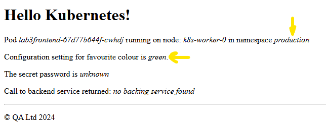
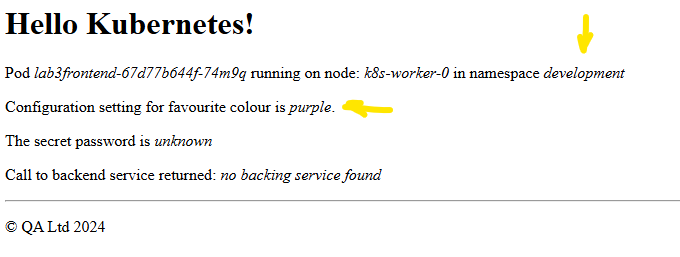
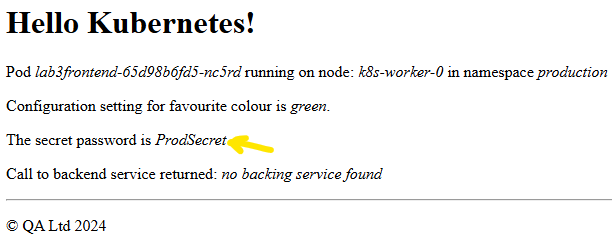
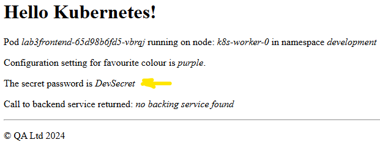

# Lab 3 - Volumes and Data
## 3.1 Volume mounts

### Task 0 - lab reset

Run the following to ensure the lab environment is in a 'known' state, ignoring any error messages:

```bash
cd ~
kubectl delete deployment lab2backend
kubectl delete namespaces production
kubectl delete namespaces development
rm *.yaml
```


### Task 1 - explore emptyDirs

1. Create a pod manifest using the `abhirockzz/kvstore` image use the `dry-run` and `-o yaml` technique to create a file called `lab3kv.yaml`. This is an image that runs a simple key/value store that uses the file system to store values.

```bash
kubectl run kvstore --image=abhirockzz/kvstore --dry-run=client -o yaml > lab3kv.yaml
```

2. Apply the YAMLfest and then find the new pod's IP address.

```bash
kubectl apply -f lab3kv.yaml
kubectl get pod -o wide
```

Example output:

```bash
pod/kvstore created

NAME  READY  STATUS   RESTARTS   AGE     IP               NODE
test  1/1    Running  0          22m     192.168.230.21   k8s-worker-1
```

<br/>

3. Try to put some data into the store. It will fail.

```bash
 curl {pod-ip}:8080/save -d 'name=Nefertiti'
```

Example output:

```
Failed to create file /data/name due to --- open /data/name: no such file or directory
```

<br/>

4. We need to ensure that the `/data` directory exists. Start by deleting the existing pod.

```bash
kubectl delete pod kvstore
```

5. Modify the auto-created manifest file lab3kv.yaml. Add a `volume` named `data-volume` of the `emptyDir` type and add a `volumeMount` to the container definition that mounts `data-volume` at `/data`

lab3kv.yaml:

```yaml
apiVersion: v1
kind: Pod
metadata:
  labels:
    run: kvstore
  name: kvstore
spec:
  containers:
  - image: abhirockzz/kvstore
    name: kvstore
# ------ Add these lines -----------
    volumeMounts:
    - mountPath: /data
      name: data-volume
  volumes:
  - name: data-volume
    emptyDir: {}
# ----- Delete all lines below ------
```

6. Apply the YAMLfest again and find out the new pod's IP address.

```bash
kubectl apply -f lab3kv.yaml
kubectl get pod -o wide
```

Example output:

```
pod/kvstore created

NAME  READY  STATUS   RESTARTS   AGE     IP               NODE
test  1/1    Running  0          22m     192.168.230.22   k8s-worker-1
```

<br/>

7. Retry adding data to the store. Make sure you're curling your pod's IP address.

```bash
 curl {pod-ip}:8080/save -d 'name=Nefertiti'
```

Example output:

```
Saved value Nefertiti to /data/name
```

<br/>

8. Now try reading the data.

```bash
 curl {pod-ip}:8080/read/name
```

Example output:

```
Nefertiti
```

9. Delete the pod.

```bash
kubectl delete pod kvstore
```


## 1.2 ConfigMaps

### Task 2 - create a ConfigMap from an index.html file

10. Create a deployment named ***lab3web***', using the ***httpd*** image with 3 replicas, in a manifest file named ***lab3web.yaml***

```bash
kubectl create deployment lab3web --image=httpd --replicas=3 --dry-run=client -o yaml > lab3web.yaml
```

10. `Apply` the YAMLfest and `expose` it as a service on port 80.

```bash
kubectl apply -f lab3web.yaml && kubectl expose deployment lab3web --port=80
```

12. Find out the `ClusterIP` of the new service and **cURL** it.

```bash
kubectl get service lab3web
curl {service cluster-ip}
```

Example output:

```
NAME         TYPE        CLUSTER-IP     EXTERNAL-IP   PORT(S)          AGE
lab3web      ClusterIP   10.43.137.86   <none>        80/TCP           5s

curl 10.43.137.86
```

<br/>

Example output:

```
<html><body><h1>It works!</h1></body></html>
```

<br/>

14. Now create a file named `index.html` in your home directory. Its contents should be similar to the following, but feel free to customise the "welcome" message to suit yourself:


```bash
echo '<html><body><h1>Welcome to my home page</h1></body></html>' > ~/index.html
```

15. Delete the existing deployment (but not the service).

```bash
kubectl delete deployment lab3web
```

16. Create a ConfigMap from the `index.html` file.

```bash
kubectl create configmap homepage --from-file ~/index.html
```

17. Copy lab3web.yaml to lab3web2.yaml

```
cp lab3web.yaml lab3web2.yaml
```

18. In ***lab3web2.yaml***, add a configMap volume, using the newly-created homepage configmap. Add a volumeMount to the container with a mountPath of /usr/local/apache2/htdocs. [NOTE: We could add additional files to the configmap and they'd be mounted in the same directory]

```
    spec:
      containers:
      - image: httpd
        name: httpd
#--------- Add these lines ------------
        volumeMounts:
        - name: homepage
          mountPath: /usr/local/apache2/htdocs
      volumes:
      - name: homepage
        configMap:
          name: homepage
#--------- Delete all lines below --------
```

18. Delete and then recreate the `lab3web` deployment.

```bash
kubectl delete deployment lab3web
kubectl create -f lab3web2.yaml
kubectl get svc lab3web
```

19. And **cURL** your lab3web service IP address again.

```bash
curl {service cluster-ip}
```

Example output:

```bash
<html><body><h1>Welcome to my home page!</h1></body></html>
```

### Task 3 - modify the simple frontend deployment to use configmaps in environment variables

We now shift focus from a simple web app, used to demonstrate ConfigMaps, back to our main frontend/backend application stack.

Let's clean-up first:

```
kubectl delete deployment lab3web
kubectl delete svc lab3web
kubectl delete configmaps homepage  
```

The simple frontend application has a placeholder for a `COLOUR` environment variable. We're going to add different values for that in our different namespaces using ConfigMaps.

20. Create a ConfigMap in both development and production namespaces. Name the configmap `settings` and create a `colour` setting from a literal value with different values in each namespace. We will use Purple for Development and Green for Production.

```bash
kubectl create namespace development 
kubectl create namespace production 
kubectl create configmap settings --from-literal=colour=purple --namespace development
kubectl create configmap settings --from-literal=colour=green --namespace production
```

21. Create a copy of the frontend deployment manifest created in lab2, renamed to lab3frontend.yaml and with updated 'lab3' labels:

```
cp ./qakf-3day/solutions/lab2/lab2frontend_stretch.yaml lab3frontend.yaml && \
sed -i 's/lab2/lab3/g' lab3frontend.yaml
```

21. Edit the newly created **lab3frontend.yaml** file to add another `env` setting named `COLOUR` that gets its value from the `configMapKeyRef` we just created and with a `key` of `colour`. 

```yaml
apiVersion: apps/v1
kind: Deployment
metadata:
  labels:
    app: lab3frontend
  name: lab3frontend
spec:
  replicas: 1
  selector:
    matchLabels:
      app: lab3frontend
  template:
    metadata:
      labels:
        app: lab3frontend
    spec:
      containers:
      - image: public.ecr.aws/qa-wfl/qa-wfl/qakf/sfe:v1
        name: sfe
        env:
        - name: NAMESPACE
          valueFrom:
            fieldRef:
              fieldPath: metadata.namespace
        - name: NODE_NAME
          valueFrom:
            fieldRef:
              fieldPath: spec.nodeName
        - name: POD_NAME
          valueFrom:
            fieldRef:
              fieldPath: metadata.name
# ------ Add these lines ------        
        - name: COLOUR
          valueFrom:
            configMapKeyRef:
              name: settings
              key: colour
```

22. Create a front end deployment in both the production and development namespaces. You did this in the second lab.

```bash
kubectl apply -f lab3frontend.yaml -n development
kubectl apply -f lab3frontend.yaml -n production
```

23. Create a NodePort service exposing the deployment in both namespaces. Remember that the application is running on port 8080.

```bash
kubectl expose deployment lab3frontend --port 8080 --type NodePort -n production 
kubectl expose deployment lab3frontend --port 8080 --type NodePort -n development
```

24. Obtain the nodeport of both services and then browse to them.

```bash
kubectl get service --all-namespaces | grep lab3frontend
```

25. Test each deployment by using your local browser to browse to http:{your controller public-ip}:{port 3xxxx}





Don't close these browser tabs as we will return and refresh later when we include a secret for each namespace.

## 1.3 Secrets

### Task 4 - work with secrets

26. Create a `secret` called `secrets` from a literal value with a key of `password` in the dev and prod namespaces, with different values for each password.

```bash
kubectl create secret generic secrets --from-literal password=DevSecret --namespace development
kubectl create secret generic secrets --from-literal password=ProdSecret --namespace production
```

21. Duplicate the frontend deployment manifest lab3frontend.yaml as **lab3frontend2**.yaml:

```
cp lab3frontend.yaml lab3frontend2.yaml
```

27. Edit the new lab3frontend2.yaml file, adding a `volume` to the deployment with a `name` of `secret-volume` and a `type` of `secret`, referencing your newly-created `secret`. Add a `volumeMount` to the container that mounts your secret at `/data`

```yaml
apiVersion: apps/v1
kind: Deployment
metadata:
  labels:
    app: lab3frontend
  name: lab3frontend
spec:
  replicas: 1
  selector:
    matchLabels:
      app: lab3frontend
  template:
    metadata:
      labels:
        app: lab3frontend
    spec:
      containers:
      - image: public.ecr.aws/qa-wfl/qa-wfl/qakf/sfe:v1
        name: sfe
        env:
        - name: NAMESPACE
          valueFrom:
            fieldRef:
              fieldPath: metadata.namespace
        - name: NODE_NAME
          valueFrom:
            fieldRef:
              fieldPath: spec.nodeName
        - name: POD_NAME
          valueFrom:
            fieldRef:
              fieldPath: metadata.name
        - name: COLOUR
          valueFrom:
            configMapKeyRef:
              name: settings
              key: colour
# ------ Add the lines below ------
        volumeMounts:
        - name: secret-volume
          mountPath: /data
      volumes:
      - name: secret-volume
        secret:
          secretName: secrets
```

28. Apply these deployment changes:

```bash
kubectl apply -f lab3frontend2.yaml -n development
kubectl apply -f lab3frontend2.yaml -n production
```

29. Obtain the nodeport of both services and then browse to them (or refresh your existing connections).

```bash
kubectl get service --all-namespaces | grep lab3
```





30. Tidy up. Delete all three deployments and the three services.

```bash
kubectl delete deploy lab3frontend -n production
kubectl delete deploy lab3frontend -n development
kubectl delete service lab3frontend -n production
kubectl delete service lab3frontend -n development
```

31. That's it, you're done! Let your instructor know that you've finished the lab.