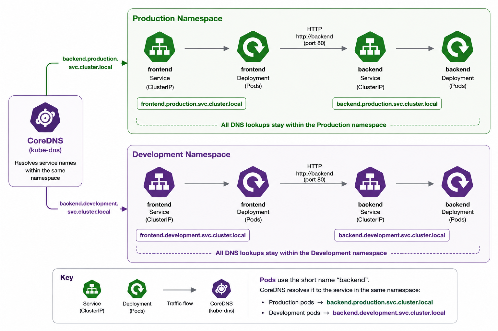
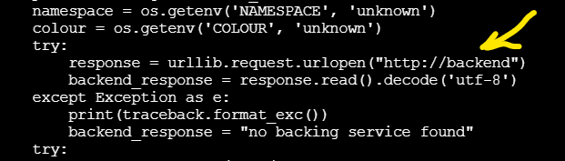
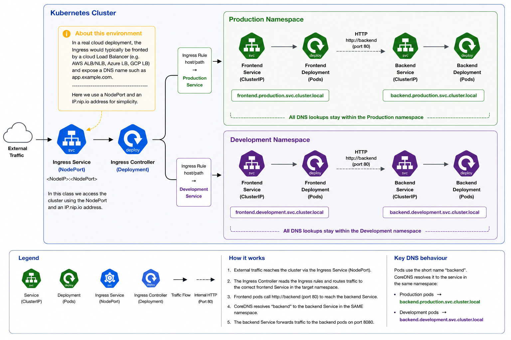
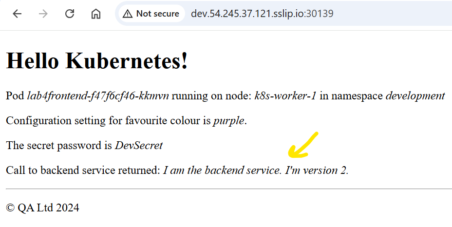
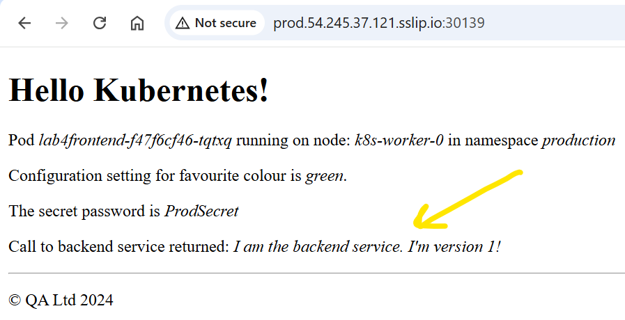

# Lab 4 - Networking

## 4.0 Before you begin

Run the following to ensure the lab environment is in a 'known' state, ignoring any error messages:

```bash
kubectl create namespace development || true
kubectl create namespace production || true
kubectl create configmap settings --from-literal=colour=purple --namespace development || true
kubectl create configmap settings --from-literal=colour=green --namespace production || true
kubectl create secret generic secrets --from-literal password=DevSecret --namespace development || true
kubectl create secret generic secrets --from-literal password=ProdSecret --namespace production || true
```


## 4.1 Explore CoreDNS


Our application consists of a frontend (the user interface) and a backend (the application logic). The frontend pod never accesses backend pods directly, it communicates with them  through the backend service. By deploying different backend versions (v2 in development and v1 in production), we can clearly demonstrate namespace isolation and show how CoreDNS ensures that each frontend communicates only with the backend in its own environment.

1. Create backend deployments using `public.ecr.aws/qa-wfl/qa-wfl/qakf/sbe` in each of the `dev` and `prod` namespaces, using the `:v2` image in `dev` and the `:v1` image in `production`.

<details><summary>show command</summary>
<p>

```
kubectl create deploy lab4backend --image=public.ecr.aws/qa-wfl/qa-wfl/qakf/sbe:v1 -n production 
kubectl create deploy lab4backend --image=public.ecr.aws/qa-wfl/qa-wfl/qakf/sbe:v2 -n development
```

</p>
</details>
<br/>

2. Expose them both as `clusterIP` services on `port` 80 with a `target-port` of 8080, giving them both a `name` of `backend`.

<details><summary>show command</summary>
<p>

```
kubectl expose deployment lab4backend --port 80 --target-port 8080 --name backend -n production 
kubectl expose deployment lab4backend --port 80 --target-port 8080 --name backend -n development
```

</p>
</details>
<br/>

3. So, how does one pod 'find' another pod in the cluster ? It uses DNS. To see how this happens, we are going to use a `busybox` image to interact with DNS using nslookups. This will create a pod container that we can connect to and perform nslookups, simulating what our frontend pod will automatically do in order to find a backend pod. Create a pod named `nettools` in both the `dev` and `prod` namespaces. Use the `busybox` image. You'll need it to run a `command` of `sleep infinity` or it will immediately transition to a `completed` state.

<details><summary>show commands</summary>
<p>

```bash
kubectl run nettools --image=busybox -n production --command sleep infinity
kubectl run nettools --image=busybox -n development --command sleep infinity
```

</p>
</details>
<br/>

4. Use `kubectl exec` to execute the command `nslookup backend` on the two pods in the two different namespaces.

<details><summary>show command</summary>
<p>

```
kubectl exec -it nettools -n production -- nslookup backend
kubectl exec -it nettools -n development -- nslookup backend
```
</p>
</details>
<br/>

Example output (with emphasis added):

```
Server:         10.96.0.10
Address:        10.96.0.10:53

** server can't find backend.cluster.local: NXDOMAIN

Name:   backend.development.svc.cluster.local     <<<<<< *** here *** >>>>>>
Address: 10.107.29.209                            <<<<<< *** here *** >>>>>>    

** server can't find backend.svc.cluster.local: NXDOMAIN
** server can't find backend.cluster.local: NXDOMAIN
** server can't find backend.svc.cluster.local: NXDOMAIN

command terminated with exit code 1
```
<br/>

Note that CoreDNS tried a lot of variations of the name `backend` but one of the first was for `backend.development.svc.cluster.local` in this case. When run against the prod namespace, it'll look there. This is to illustrate that CoreDNS "knows" which namespace a pod is running in and returns the appropriate lookup.

5. There's only one empty placeholder remaining in our simple front end application, the data it receives from the backing service, obtained by performing an nslookup, just as we did using busybox. Let's finish that off now by applying a copy of the frontend deployment created in lab3 into both namespaces:

```bash
cp ./qakf-3day/solutions/lab3/lab3frontend2.yaml lab4frontend.yaml && \
sed -i 's/lab3/lab4/g' lab4frontend.yaml
kubectl apply -n production -f lab4frontend.yaml
kubectl apply -n development -f lab4frontend.yaml
```

6. Get the new pods' details from the development and production namespaces. Ask for `wide` output so you can see their IP addresses.

```bash
kubectl -n production get pods --output wide | grep frontend
kubectl -n development get pods --output wide | grep frontend
```

Example output:

```
student@k8s-controller-0:~$ kubectl -n production get pods --output wide | grep frontend
lab4frontend-f47f6cf46-55xk6   1/1     Running   0          3h49m   10.0.0.212   k8s-worker-0   <none>           <none>
student@k8s-controller-0:~$ kubectl -n development get pods --output wide | grep frontend
lab4frontend-f47f6cf46-xfr92   1/1     Running   0          3h49m   10.0.1.147   k8s-worker-1   <none>           <none>
```

7. ***curl {ip}:8080***, using each frontend pods' IP address in turn. You should see a v2 message in the development namespace and a v1 message in production. Note that this is all internal as we have not yet exposed the frontends.

Example output:

```
    <p>Call to backend service returned: <em>I am the backend service. I&#39;m version 1!
```

8. **Optional but useful**: `exec` into one of your frontend pods and inspect the application code. See (around the 25th line) it's just asking for "http://backend"? That's basically what you did earlier with the nslookups. CoreDNS still knows which namespace your workload is running in. And the lack of a port number is why we had to have the service listening on port 80 but forwarding to 8080 (which the app is listening on).

```bash
kubectl exec -it <frontend -pod-name> -n production -- cat /code/app/main.py
```



## 4.2 Install an ingress controller



Until now we've exposed our frontend applications using NodePort services. Although this is perfectly adequate for our lab environment, production deployments typically use an Ingress Controller to provide external access. Backend services remain internal to the cluster as ClusterIP services, while frontend traffic is routed through the ingress layer. In this exercise, we'll deploy a single NGINX Ingress Controller and create separate ingress rules to direct traffic to the development and production frontends.

9. Run the following command to install an Nginx Ingress Controller. A whole bunch of resources will be created. Helm is a package manager for Kubernetes, which we haven't covered yet, but we will, in the very next module.

```bash
helm install ingress-nginx ingress-nginx \
  --repo https://kubernetes.github.io/ingress-nginx \
  --namespace ingress-nginx --create-namespace
```

10. Check that the ingress service is running. Get a list of all services in all namespaces.

<details><summary>show command</summary>
<p>

```bash
kubectl get services --all-namespaces
```

</p>
</details>
<br/>

Example output (modified):

```
NAMESPACE       NAME                                 TYPE           CLUSTER-IP       EXTERNAL-IP   PORT(S)                      AGE
development     backend                              ClusterIP      10.102.60.108    <none>        80/TCP                       14m
production      backend                              ClusterIP      10.105.142.21    <none>        80/TCP                       19m
ingress-nginx   ingress-nginx-controller             LoadBalancer   10.107.57.60     <pending>     80:31886/TCP,443:30765/TCP   72s
ingress-nginx   ingress-nginx-controller-admission   ClusterIP      10.104.181.164   <none>        443/TCP                      72s
```

You should see an ingress-nginx-controller service of type LoadBalancer.

Note: Because this lab is not integrated with a cloud provider, the EXTERNAL-IP will remain as 'pending'. In a managed Kubernetes service such as AKS, EKS or GKE, Kubernetes would automatically provision a cloud load balancer and populate this field with its external IP address or hostname.

Although the service is of type LoadBalancer, it is still accessible via the automatically allocated NodePort (here shown as 31886 for http). We'll use that NodePort throughout the remainder of the lab.

11. Make a note of the nodePort number of ***your*** `ingress-nginx-controller` service. Browse to http://{controller-publicip:nodePort} from your local browser. You should get a 404 File Not Found error because we haven't configured any backends. That's ingress backends, not our simple backend service, and we're going to sort that out now.

## 4.3 Expose the frontends

12. Expose both of the frontends in the two different namespaces. Expose them both as `clusterIP` services on `port` 80 with a `target-port` of 8080, giving them both a `name` of `frontend`.

<details><summary>show commands</summary>
<p>

```bash
kubectl expose deployment lab4frontend --port 80 --target-port 8080 --name frontend -n production 
kubectl expose deployment lab4frontend --port 80 --target-port 8080 --name frontend -n development
```

</p>
</details>
<br/>

13. Check that you can reach them both by finding their IP addresses and **cURL**ing them.

<details><summary>show command</summary>
<p>

```bash
kubectl get svc -A
curl dev-frontend-service-ip
curl prod-frontend-service-ip
```

</p>
</details>
<br/>

14. Create an ingress rule manifest called `devingress.yaml` for the dev frontend using sslip.io in the dev namespace. Replace `{controller-pubic-ip}` with your controllers public IP address.

devingress.yaml:

```yaml
apiVersion: networking.k8s.io/v1
kind: Ingress
metadata:
  name: dev-ingress
  namespace: development
spec:
  ingressClassName: nginx
  rules:
  - host: dev.{controller-pubic-ip}.sslip.io # <Update this line>
    http:
      paths:
      - path: /
        pathType: ImplementationSpecific
        backend:
          service:
            name: frontend
            port:
              number: 80
```

15. Create the ingress.

<details><summary>show command</summary>
<p>

```bash
kubectl create -f devingress.yaml
```

</p>
</details>
<br/>

16. Point your web browser at *dev*.**your-ip***.sslip.io*:**ingress-nodePort**, for example in this instance it's `dev.54.245.37.121.sslip.io:30139` 



17. Create another ingress for the production namespace named prodingress.yaml by copying devingress.yaml. Then update prodingress.yaml to reflect the production namespace:

```
cp devingress.yaml prodingress.yaml
```

<details><summary>show prodingress.yaml</summary>
<p>

prodingress.yaml:

```yaml
apiVersion: networking.k8s.io/v1
kind: Ingress
metadata:
  name: prod-ingress    #change this from dev
  namespace: production #change this from development
spec:
  ingressClassName: nginx
  rules:
  - host: prod.{controller-public-ip}.sslip.io #change this from dev
    http:
      paths:
      - path: /
        pathType: ImplementationSpecific
        backend:
          service:
            name: frontend
            port:
              number: 80
```

</p>
</details>
<br/>

18. Apply and test the prodingress.yaml file, similar to steps 15 and 16 above (just replace "prod" with "dev" in those commands).



19. That's it, you're done! Let your instructor know that you've finished the lab.