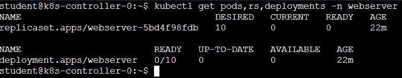

# Lab 6a.2 – Deploying and Hardening a Production Workload

## Learning Objectives

By the end of this lab you will be able to:

- Deploy an application into a governed Kubernetes namespace.
- Interpret Deployment, ReplicaSet and Pod events.
- Understand how Pod Security Admission affects workload creation.
- Configure container security settings.
- Apply CPU and memory requests and limits.
- Deploy an application using a non-root container image.
- Understand the relationship between ResourceQuotas and replica counts.
- Expose an application using a ClusterIP Service.

---

# Background

In the previous lab you acted as the **platform engineering team**, preparing a Kubernetes cluster with security, governance and networking controls.

In this lab you switch roles and become an **application developer**.

Your task is deliberately simple: deploy an NGINX web server.

However, because the namespace has already been secured, your workload will not deploy successfully on the first attempt. Instead, you will encounter a series of failures, each highlighting an important Kubernetes platform feature.

Rather than treating these failures as problems, think of them as diagnostic checkpoints. Each one reveals another aspect of how Kubernetes protects the cluster.

---

# Starting Point

Confirm the platform components created in Lab 6a.1 are present.

```bash
kubectl get ns
kubectl get quota -A
kubectl get networkpolicy -A
kubectl get pods -n ingress
```

The **webserver** namespace should already contain:

- Restricted Pod Security
- ResourceQuota
- NetworkPolicies

The NGINX Ingress Controller should also be running in the **ingress** namespace.

---

# Phase 1 – Generate an Initial Deployment

## Why?

Most developers begin with a simple deployment generated by `kubectl create`. This creates a perfectly valid manifest, but it contains none of the security or resource settings required by your platform.

Generate the starter manifest:

```bash
kubectl create deployment webserver \
  --replicas=10 \
  --image=nginx:alpine \
  --port=80 \
  --dry-run=client -o yaml > deploy.yaml
```

Open **deploy.yaml** and review its contents.

Ask yourself:

- Does it define a security context?
- Does it specify resource requests?
- Does it declare limits?
- Is the image designed for non-root execution?

---

# Phase 2 – Attempt the Deployment

Apply the manifest.

```bash
kubectl apply -n webserver -f deploy.yaml
```
Error messages are displayed regarding PodSecurity violations.
Lets find out what, if anything, has been created:

```bash
kubectl get pods,rs,deployments -n webserver
```



The deployment has deployed. The replicaset that makes up the deployment has been deployed. This issue is that none of the 10 desired pods have been deployed, because the manifest to create them does not include PodSecurity parameters.

Understanding this 'Deployment > Replicaset > Pod' relationship is essential when troubleshooting Kubernetes applications.

---

# Phase 3 – Satisfy the Pod Security Standard requirements

The initial warning told us that the Restricted Pod Security Standard, in effect for the Webserver namespace, has rejected the Pod specification.

Add the required container `securityContext` to ***deploy.yaml*** and reapply the manifest.

```yaml
apiVersion: apps/v1
kind: Deployment
metadata:
  labels:
    app: webserver
  name: webserver
spec:
  replicas: 10
  selector:
    matchLabels:
      app: webserver
  template:
    metadata:
      labels:
        app: webserver
    spec:
      containers:
      - image: nginx:alpine
        name: nginx

        # =====================================================
        # BEGIN ADDITION - Lab 6a.2 Phase 3
        #
        # Add a container securityContext so the Pod can satisfy
        # the Restricted Pod Security Standard.
        # =====================================================
        securityContext:
          runAsNonRoot: true
          allowPrivilegeEscalation: false
          capabilities:
            drop:
            - ALL
          seccompProfile:
            type: RuntimeDefault
        # =====================================================
        # END ADDITION - Lab 6a.2 Phase 3
        # =====================================================

        ports:
        - containerPort: 80
        resources: {}

```
Verify the outcome again.

``` bash
kubectl delete deployment webserver -n webserver
kubectl apply -n webserver -f deploy.yaml
```
There are no error messages displayed, but what has been deployed ? Lets find out:

```bash
kubectl get pods,rs,deployments -n webserver
```
There are still no pods!

Why? Lets delve deeper and first 'describe' the deployment and see if there are any clues:

``` bash
kubectl describe deployments.apps -n webserver
```

Read the output and you will see that the ReplicaSet failed to create the 10 desired replicas (pods). It mentions 'MinimumRepicasUnavailable' which might lead us towards a quotaing issue given that the Platform team has limited the namespace to a maximum of 5 pods.

Lets dig deeper and focus on the replicaset itself:

``` bash
kubectl describe rs -n webserver
```
Well now we see a more fundemantal issue, lots of repeated warnings regarding quota requirements... 

*'failed quota: webserver-quota: must specify cpu for: nginx; memory for: nginx'*

The key portion in the message is 'must specify' for cpu and memory consumption.

Our deploy manifest has no mention of CPU or Memory allocations, the amount of each that the pod requires.

### Behind the Scenes

Notice that Kubernetes has not modified your manifest.
Instead, the Admission Controller simply accepts or rejects it. Responsibility for producing a compliant workload manifest remains with the application developer.

---

# Phase 4 – Resolve ResourceQuota Failures

Update deploy.yaml so that the deployment complies with requirements:

```yaml
apiVersion: apps/v1
kind: Deployment
metadata:
  labels:
    app: webserver
  name: webserver
spec:
  replicas: 10
  selector:
    matchLabels:
      app: webserver
  template:
    metadata:
      labels:
        app: webserver
    spec:
      containers:
      - image: nginx:alpine
        name: nginx
        securityContext:
          runAsNonRoot: true
          allowPrivilegeEscalation: false
          capabilities:
            drop:
            - ALL
          seccompProfile:
            type: RuntimeDefault
        ports:
        - containerPort: 80

        # =====================================================
        # BEGIN REPLACEMENT - Lab 6a.2 Phase 4
        #
        # Replace:
        #
        # resources: {}
        #
        # with explicit CPU and memory requests and limits.
        # This allows the Pod to satisfy the namespace ResourceQuota.
        # =====================================================
        resources:
          requests:
            cpu: 100m
            memory: 100Mi
          limits:
            cpu: 100m
            memory: 100Mi
        # =====================================================
        # END REPLACEMENT - Lab 6a.2 Phase 4
        # =====================================================
status: {}
```

Apply the Deployment again.

``` bash
kubectl delete deployment webserver -n webserver
kubectl apply -n webserver -f deploy.yaml
```

### Behind the Scenes

Requests influence scheduling.

Limits constrain runtime consumption.

ResourceQuotas ensure that every workload declares these values before consuming shared cluster resources.

---

# Phase 5 – Resolve the Image Problem

Lets see what the results of our last deployment are:

```bash
kubectl get pods,rs,deployments -n webserver
```

Mmmmm, well we now have 5 pods, not the 10 we were hoping for, and the containers in the 5 are failing to start.

The standard `nginx:alpine` image expects to run as root, conflicting with the namespace security policy.

Update deploy.yaml and replace the current image, also update the container port from 80 to 8080:

```yaml
apiVersion: apps/v1
kind: Deployment
metadata:
  creationTimestamp: null
  labels:
    app: webserver
  name: webserver
spec:
  replicas: 10
  selector:
    matchLabels:
      app: webserver
  strategy: {}
  template:
    metadata:
      creationTimestamp: null
      labels:
        app: webserver
    spec:
      containers:
      - image: nginxinc/nginx-unprivileged ## <<<<<<<<<<<<<<<<
        name: nginx
        securityContext:
          runAsNonRoot: true
          allowPrivilegeEscalation: false
          capabilities:
            drop:
            - ALL
          seccompProfile:
            type: RuntimeDefault
        ports:
        - containerPort: 8080 ## <<<<<<<<<<<<<<<<<<<<
        resources:
          requests:
            cpu: 100m
            memory: 100Mi
          limits:
            cpu: 100m
            memory: 100Mi
#        resources: {}
status: {}
```
....

Reapply the Deployment.

``` bash
kubectl delete deployment webserver -n webserver
kubectl apply -n webserver -f deploy.yaml
```

### Behind the Scenes

Container security depends on both the Kubernetes configuration **and** the container image itself. A secure Pod specification cannot compensate for an image that expects elevated privileges.

---

# Phase 6 – Understand the Replica Count

Lets see what has been deployed: 

```bash
kubectl get pods,rs,deployments -n webserver
```

We have 5 running pods. What about the other 5 though? Lets looks at the deploymemt itself for clues:

``` bash
kubectl describe rs -n webserver
```

The Deployment is requesting ten Pods, while the namespace quota only permits five.

Update deploy.yaml and set the replicas count:

```yaml
replicas: 5
```

Apply the Deployment one final time.

``` bash
kubectl delete deployment webserver -n webserver
kubectl apply -n webserver -f deploy.yaml
kubectl describe rs -n webserver
```

---

# Phase 7 – Publish the Application

Create a ClusterIP Service.

```bash
kubectl expose deployment webserver \
  --type=ClusterIP \
  --port=8080 \
  --target-port=8080 \
  -n webserver
```

Verify:

```bash
kubectl get svc -n webserver
kubectl get endpoints -n webserver
```

### Behind the Scenes

The Service provides a stable virtual IP address while the Pods behind it can be replaced, scaled or rescheduled without affecting clients.

---

# Platform Verification

Confirm:

```bash
kubectl get deploy,pods,svc -n webserver
kubectl describe deployment webserver -n webserver
```

You should have:

- Five running Pods.
- One healthy Deployment.
- One ClusterIP Service.
- No admission or quota errors.

---

# Knowledge Check

1. Why did the first Pods fail admission?
2. Why did the ReplicaSet report quota errors?
3. Why was the unprivileged NGINX image required?
4. Why were only five Pods created initially?
5. Why is a Service created instead of connecting directly to Pods?

---

# Summary

You have successfully adapted an application to operate within a governed Kubernetes platform.

Rather than disabling the platform controls, you modified the workload until it complied with the organisation's standards.

In the next lab you will expose this application through the NGINX Ingress Controller and investigate the networking, DNS and cross-namespace routing challenges involved in publishing applications safely.
