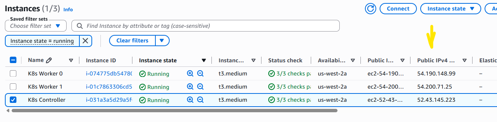

## Final fix... enjoy UKTL :-)

# Lab 6a.3 – Publishing a Governed Application

## Learning Objectives

By the end of this lab you will be able to:

- Publish an application through the NGINX Ingress Controller.
- Create and verify an Ingress resource.
- Understand why the Ingress Controller runs on the worker nodes.
- Use `sslip.io` to create a hostname for testing.
- Follow the complete request path from browser to application.
- Troubleshoot common Ingress deployment problems.

---

# Background

In Lab 6a.1 you acted as the Platform Engineering team, preparing a governed Kubernetes environment.

You created:

- Dedicated namespaces
- Pod Security Admission
- ResourceQuotas
- NetworkPolicies
- An NGINX Ingress Controller

In Lab 6a.2 you switched roles and became an Application Developer.

You successfully deployed a compliant NGINX workload into the **webserver** namespace and exposed it internally using a ClusterIP Service.

The application is now healthy, but it can only be reached from within the cluster.

In this lab you will publish the application through the NGINX Ingress Controller.

---

# Request Path

By the end of this lab, traffic should follow the path below.

```
Browser
    │
    ▼
webserver.<WORKER-PUBLIC-IP>.sslip.io
    │
    ▼
Worker Node Public IP
    │
    ▼
NodePort
    │
    ▼
NGINX Ingress Controller
    │
    ▼
ClusterIP Service
    │
    ▼
webserver Pods
```

Each phase of this lab builds one section of this request path.

---

# Starting Point

Verify that the application deployed in Lab 6a.2 is still healthy.

```bash
kubectl get deploy,pods,svc -n webserver
kubectl get pods,svc -n ingress
```

You should see:

- Five running webserver Pods.
- A ClusterIP Service called **webserver**.
- Running NGINX Ingress Controller Pods.

If any of these resources are missing, complete Lab 6a.2 before continuing.

---

# Phase 1 – Identify the Ingress Worker

## Why?

The NGINX Ingress Controller was installed as a **DaemonSet**.

Unlike a Deployment, a DaemonSet creates one Pod on every worker node.

These Pods receive incoming HTTP requests.

The Kubernetes controller node is used to administer the cluster and does **not** receive application traffic.

This distinction is extremely important.

Display the Ingress Controller Pods:

```bash
kubectl get pods -n ingress -o wide
```

Example:

```text
NAME                             READY   STATUS    NODE
nginx-ingress-controller-abc12   1/1     Running   k8s-worker-0
nginx-ingress-controller-def34   1/1     Running   k8s-worker-1
```

Notice the **NODE** column.

Now display the cluster nodes.

```bash
kubectl get nodes -o wide
```

Example:

```text
NAME              STATUS   ROLES           INTERNAL-IP    EXTERNAL-IP
k8s-controller-0  Ready    control-plane   10.0.1.10      <none>
k8s-worker-0      Ready    <none>          10.0.2.20      <none>
k8s-worker-1      Ready    <none>          10.0.3.20      <none>
```
Switch to your EC2 dashboard in the AWS console and identify the Public IP address of one of your **Worker** nodes:



Locate one of the **Worker** nodes that is running an Ingress Controller Pod.

For example:

```text
54.200.71.25
```

This worker node public IP will be used throughout the remainder of the lab.

### Behind the Scenes

A very common mistake is to use the public IP address of the Kubernetes controller node because that is where `kubectl` is being executed.

However, browser traffic never passes through the controller node.

The request enters the cluster through one of the worker nodes hosting an Ingress Controller Pod.

Using the controller node's public IP will usually result in connection failures.

---

# Phase 2 – Create the Hostname

The hostname used by the Ingress must resolve to the public IP address of the worker node.

Using the public IP identified in the previous phase, construct the following hostname for later use:

```text
webserver.<WORKER-PUBLIC-IP>.sslip.io
```

Example:

```text
webserver.54.200.71.25.sslip.io
```

The `sslip.io` service automatically resolves hostnames containing an IP address back to that IP address.

(Optional) Verify that the hostname resolves correctly.

```bash
nslookup webserver.<WORKER-PUBLIC-IP>.sslip.io
```

or

```bash
getent hosts webserver.<WORKER-PUBLIC-IP>.sslip.io
```

You should see the worker node public IP returned.

If the hostname does not resolve correctly, check that the IP address has been entered accurately before continuing.

---

# Phase 3 – Create the Ingress Resource

## Why?

The Ingress resource defines how HTTP requests should be routed to the application.

Although the NGINX Ingress Controller is running in the **ingress** namespace, the Ingress resource itself will be created in the **webserver** namespace.

This is because the backend Service also exists in the **webserver** namespace.

Keeping the Ingress alongside its backend Service is the simplest and most common Kubernetes design.

Create a new file.

```bash
nano ingress.yaml
```

Replace **<WORKER-PUBLIC-IP>** with the worker node public IP identified in the previous phase.

```yaml
apiVersion: networking.k8s.io/v1
kind: Ingress
metadata:
  name: new-ingress
  namespace: webserver
spec:
  ingressClassName: nginx
  rules:
  - host: webserver.<WORKER-PUBLIC-IP>.sslip.io
    http:
      paths:
      - path: /
        pathType: Prefix
        backend:
          service:
            name: webserver
            port:
              number: 8080
```

Apply the manifest.

```bash
kubectl apply -f ingress.yaml
```

Verify that the Ingress has been created.

```bash
kubectl get ingress -n webserver
```

Display the full configuration.

```bash
kubectl describe ingress new-ingress -n webserver
```

You should see:

- The correct hostname.
- The backend Service.
- One or more backend Pod addresses.

For example:

```text
Rules:
  Host
  ----
  webserver.44.245.201.133.sslip.io

Backends
webserver:8080
10.244.1.10:8080
10.244.2.15:8080
...
```

Unlike previous attempts, you should **not** see:

```text
<error: endpoints "webserver" not found>
```

### Behind the Scenes

The backend specified in the Ingress is:

```yaml
backend:
  service:
    name: webserver
```

Because the Ingress itself lives in the **webserver** namespace, Kubernetes resolves this as:

```text
Service:
    webserver

Namespace:
    webserver
```

That Service already exists and has healthy endpoints.

The Ingress Controller can therefore build a valid routing configuration immediately.

---

# Phase 4 – Find the NodePort

## Why?

In a cloud Kubernetes cluster, an Ingress Controller is normally exposed through a cloud Load Balancer.

This training environment does not provide an external load balancer.

Instead, the Ingress Controller is exposed using a **NodePort** Service.

Display the Services running in the **ingress** namespace.

```bash
kubectl get svc -n ingress
```

Example:

```text
NAME                       TYPE       PORT(S)
nginx-ingress-controller   NodePort   80:31147/TCP
```

Notice the HTTP mapping.

```text
80:31147/TCP
```

Port **80** is the Service port.

Port **31147** is the NodePort.

The NodePort is the port that browsers will use.

Make a note of this value.

---

### Behind the Scenes

NodePorts expose a Service on every worker node.

Traffic therefore follows this path:

```text
Browser
      │
      ▼
Worker Public IP
      │
      ▼
NodePort
      │
      ▼
Ingress Controller Service
      │
      ▼
Ingress Controller Pod
```

Because the Ingress Controller runs as a DaemonSet, every worker node can receive traffic.

---

# Phase 5 – Publish the Application

Open a browser.

Browse to:

```text
http://webserver.<WORKER-PUBLIC-IP>.sslip.io:<NODEPORT>
```

Example:

```text
http://webserver.44.245.201.133.sslip.io:31147
```

You should now see the default NGINX welcome page.

The application can also be tested using curl.

```bash
curl http://webserver.<WORKER-PUBLIC-IP>.sslip.io:<NODEPORT>
```

Example output:

```html
<!DOCTYPE html>
<html>
<head>
<title>Welcome to nginx!</title>
...
```

Congratulations.

Your application is now accessible from outside the Kubernetes cluster.

---

### Behind the Scenes

At this point, the complete request path is operational.

```text
Browser
      │
      ▼
webserver.44.245.201.133.sslip.io
      │
      ▼
sslip.io DNS
      │
      ▼
Worker Node Public IP
      │
      ▼
NodePort
      │
      ▼
NGINX Ingress Controller
      │
      ▼
webserver Service
      │
      ▼
webserver Pods
```

Each component has a specific responsibility.

| Component | Responsibility |
|-----------|----------------|
| Browser | Sends the HTTP request |
| sslip.io | Resolves the hostname |
| Worker Node | Receives the TCP connection |
| NodePort | Forwards traffic to the Service |
| Ingress Controller | Matches the hostname and path |
| ClusterIP Service | Selects the application Pods |
| Pods | Process the HTTP request |

Understanding this request path makes troubleshooting much easier because each component can be verified independently.

---

# Phase 6 – Verify the Platform

Now that the application is accessible, verify each component of the request path.

## 1. Verify the Ingress Controller

```bash
kubectl get pods -n ingress
```

All Ingress Controller Pods should be **Running**.

---

## 2. Verify the Ingress

```bash
kubectl get ingress -n webserver
kubectl describe ingress new-ingress -n webserver
```

Confirm:

- The hostname matches the worker node public IP.
- The backend Service is `webserver:8080`.
- Backend endpoints are displayed.

---

## 3. Verify the Service

```bash
kubectl get svc webserver -n webserver
kubectl describe svc webserver -n webserver
```

Confirm the Service exposes TCP port **8080**.

---

## 4. Verify the Endpoints

```bash
kubectl get endpoints webserver -n webserver
```

You should see the IP addresses of the five running Pods.

---

## 5. Verify the Pods

```bash
kubectl get pods -n webserver
```

All Pods should be **Running**.

---

## 6. Verify the NetworkPolicy

```bash
kubectl describe networkpolicy webserver-netpol -n webserver
```

Confirm that TCP port **8080** is allowed from namespaces labelled:

```text
app=nginx-ingress
```

Confirm that the ingress namespace has this label.

```bash
kubectl get namespace ingress --show-labels
```

---

# Troubleshooting

Follow the request path from the browser towards the application.

## Browser cannot connect

Check that you are using:

- The **worker node public IP**
- The correct **NodePort**

```bash
kubectl get svc -n ingress
```

Do **not** use the controller node public IP.

---

## DNS problem

Verify the hostname resolves correctly.

```bash
nslookup webserver.<WORKER-PUBLIC-IP>.sslip.io
```

or

```bash
getent hosts webserver.<WORKER-PUBLIC-IP>.sslip.io
```

The hostname should resolve to the worker node public IP.

---

## HTTP 404

Check the hostname configured in the Ingress.

```bash
kubectl get ingress new-ingress -n webserver \
-o jsonpath='{.spec.rules[0].host}'; echo
```

The hostname in the browser and the hostname in the Ingress must be identical.

---

## HTTP 502 or 503

Check the backend Service and its endpoints.

```bash
kubectl get svc,endpoints -n webserver
kubectl get pods -n webserver
```

If the Service has no endpoints, the Ingress cannot reach the application.

---

## Ingress not updating

Check the controller logs.

```bash
kubectl logs -n ingress \
-l app.kubernetes.io/name=nginx-ingress \
--since=5m
```

Look for configuration errors.

---

# Final Expected State

```bash
kubectl get deploy,pods,svc,ingress -n webserver
kubectl get pods,svc -n ingress
kubectl get networkpolicy -A
```

Expected:

## webserver namespace

- Deployment `webserver`
- Five running Pods
- ClusterIP Service `webserver`
- Ingress `new-ingress`

## ingress namespace

- Running NGINX Ingress Controller Pods
- NodePort Service

## NetworkPolicies

- `webserver-netpol`

There should be **no** `ingress-netpol`.

---

# Knowledge Check

1. Why is the worker node public IP used instead of the controller node?

2. Why is the Ingress resource created in the `webserver` namespace?

3. What is the purpose of the NodePort?

4. What role does `sslip.io` perform?

5. Describe the complete request path from the browser to a Pod.

---

# Summary

You have successfully published a governed application through the NGINX Ingress Controller.

The request path is now:

```text
Browser
        │
        ▼
sslip.io
        │
        ▼
Worker Public IP
        │
        ▼
NodePort
        │
        ▼
NGINX Ingress Controller
        │
        ▼
webserver ClusterIP Service
        │
        ▼
webserver Pods
```

Although the application is now externally accessible, it remains protected by the NetworkPolicy created in Lab 6a.1.

This completes Module 6a and provides the foundation for the Kyverno policy labs that follow.


